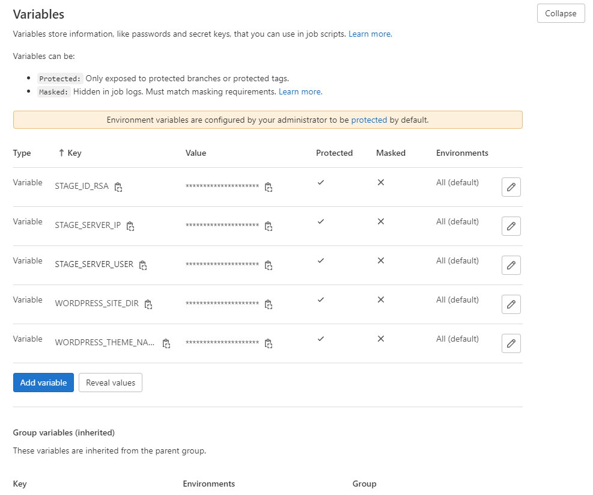
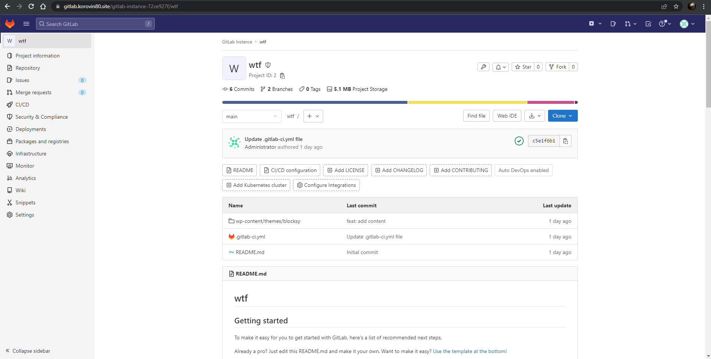
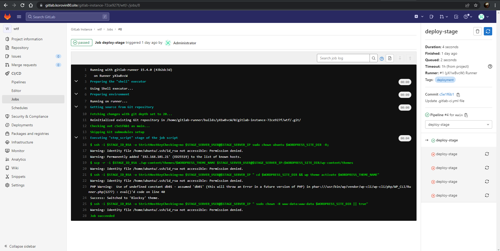

# CI/CD для деплоя темы в WordPress

## Предварительная подготовка
1. Создадим на целевом сервере ssh ключи для пользователя `ubuntu`.
2. Открытый ключ перенаправим в `~/.ssh/authorized_keys` для дальнейшего подключения.
3. Закрытый ключ нам понадобится для добавления в `Gitlab`.
## Настройка переменных GitLab CI/CD
В разделе `GitLab Project > Settings > CI/CD > Variables` создаем следующие переменные:
 - **`STAGE_ID_RSA`** – содержит закрытый ключ SSH, используемый во время сеанса SSH.
 - **`STAGE_SERVER_IP`** – содержит IP-адрес целевого сервера. Этот IP-адрес используется GitLab Runner для установления SSH-подключения к целевому серверу.
 - **`STAGE_SERVER_USER`** — содержит пользователя, используемого при открытии сеанса SSH.

 
 
## Подготовка GitLab к автоматическому развертыванию
1. Создаем новый публичный репозиторий для нашего проекта.
2. Загружаем в него наш файл `.gitlab-ci.yml` и папку с темой `wp-content`.\
 
3. При необходимости меняем значение **`WORDPRESS_THEME_NAME`** в файле `.gitlab-ci.yml` на название той темы, которую хотим поставить.
3. Подготавливаем `Runner` для работы с нашем проектом.

После завершения настройки, GitLab CI/CD автоматически развернет новую тему для WordPress.
 - **Успешно выполненный `pipeline`**

 

 - **Измененная тема на нашем сайте Wordpress**

 

Все действия при выполнении CI/CD, описаны в комментариях в файле `.gitlab-ci.yml`.
