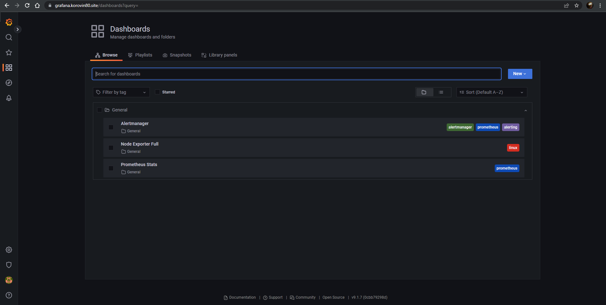
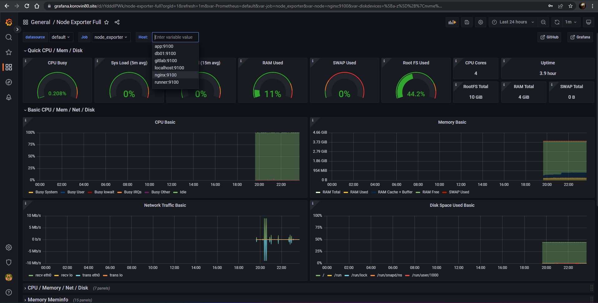

# Дипломный практикум в YandexCloud

## Цели:

1. Зарегистрировать доменное имя (любое на ваш выбор в любой доменной зоне).
2. Подготовить инфраструктуру с помощью Terraform на базе облачного провайдера YandexCloud.
3. Настроить внешний Reverse Proxy на основе Nginx и LetsEncrypt.
4. Настроить кластер MySQL.
5. Установить WordPress.
6. Развернуть Gitlab CE и Gitlab Runner.
7. Настроить CI/CD для автоматического развёртывания приложения.
8. Настроить мониторинг инфраструктуры с помощью стека: Prometheus, Alert Manager и Grafana.

[Полный текст задания](https://github.com/Topper-crypto/netology_diplom/blob/main/Diplom.md)

# Этапы выполнения

## Регистрация доменного имени

Был зарегистрирован домен `korovin80.site` на reg.ru

## Создание инфраструктуры

1. Был выбран альтернативный вариант: S3 bucket в YC аккаунте.
2. Настроили `workspaces`. Воспользовались альтернативным вариантом и использовали один workspace, назвав его `stage`.
```yaml
topper@otus:~/netology-graduate$ terraform workspace list
  default
* stage
```
3. Домен был делегирован под управление `ns1.yandexcloud.net` и `ns2.yandexcloud.net`.
4. Вся конфигурация инфраструктуры с комментариями находится в папке [terraform](https://github.com/Topper-crypto/netology-diploma/tree/master/terraform).
5. Все Ansible роли находятся в папке [ansible](https://github.com/Topper-crypto/netology-diploma/tree/master/ansible).

## Разработка Ansible ролей

Были разработаны роли для установки Nginx, LetsEncrypt, кластера MySQL, WordPress

Подробне описание ролей [по ссылке](https://github.com/Topper-crypto/netology-diploma/blob/master/Ansible.md)

## Установка Gitlab CE и Gitlab Runner

Была проведена настройка [CI/CD системы](https://github.com/Topper-crypto/netology-diploma/tree/master/ci-cd) для автоматического развертывания приложения при изменении кода.

## Установка Prometheus, Alert Manager, Node Exporter и Grafana

Были разработаны роли для установки Prometheus, Alert Manager и Grafana

Подробне описание ролей [по ссылке](https://github.com/Topper-crypto/netology-diploma/blob/master/Ansible.md)

## Скриншоты выполнения дипломной работы:

* Основная инфраструктура


* VPC с подсетями в разных зонах доступности


* DNS Записи


* Основной сайт, после выполнения роли `wordpress`


* Настроенная репликация `mysql`


* Prometheus


* Ноды в Prometheus


* Alertmanager


* Grafana 



* Dashboards Node Exporter



* Gitlab и Gitlab Runner


